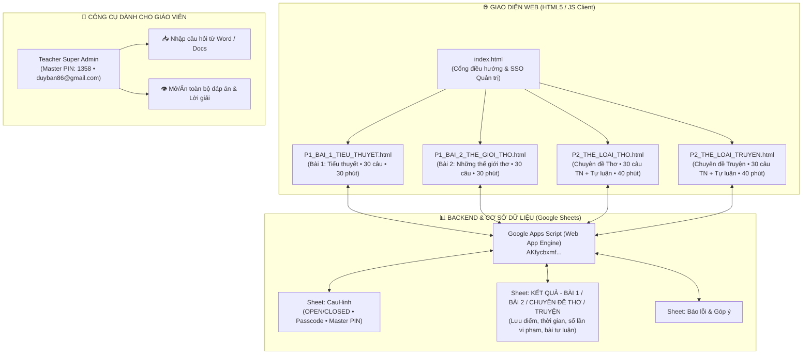

# 📖 HƯỚNG DẪN SỬ DỤNG & VẬN HÀNH TOÀN DIỆN
## HỆ THỐNG ÔN TẬP & ĐÁNH GIÁ NĂNG LỰC NGỮ VĂN 12 (NĂM HỌC 2026 - 2027)

---

## 🧭 I. TỔNG QUAN KIẾN TRÚC HỆ THỐNG

Hệ thống được thiết kế theo mô hình **Tam vị nhất thể (Web App + Google Sheets Backend + Word Docs)**, tương thích hoàn toàn với Chương trình GDPT 2018:



---

## 👥 II. HƯỚNG DẪN DÀNH CHO GIÁO VIÊN (QUẢN TRỊ VIÊN)

### 1. Thông tin Quản trị viên Tối cao
- **Email quản trị**: `duyban86@gmail.com`
- **Mã Master PIN Giáo viên**: `1358` *(dùng để mở khóa tức thì trên mọi giao diện)*
- **Link Google Apps Script Backend**: `https://script.google.com/macros/s/AKfycbxmf7eFagsotgPVz0TVAD4qu_OZAOinePGkTpi7vPLbYv7LRfE_IfLTF9sfYPz14Ss/exec`

---

### 2. Kích hoạt Quyền Quản trị viên trên Web
Trên giao diện bài thi bất kỳ ([index.html](file:///D:/OneDrive/1.%20Chuy%C3%AAn%20m%C3%B4n/7.%20N%C4%83m%20h%E1%BB%8Dc%202026-2027/14.%20K12-VAN-TN/index.html), [P1_BAI_1_TIEU_THUYET.html](file:///D:/OneDrive/1.%20Chuy%C3%AAn%20m%C3%B4n/7.%20N%C4%83m%20h%E1%BB%8Dc%202026-2027/14.%20K12-VAN-TN/P1_BAI_1_TIEU_THUYET.html), [P1_BAI_2_THE_GIOI_THO.html](file:///D:/OneDrive/1.%20Chuy%C3%AAn%20m%C3%B4n/7.%20N%C4%83m%20h%E1%BB%8Dc%202026-2027/14.%20K12-VAN-TN/P1_BAI_2_THE_GIOI_THO.html), [P2_THE_LOAI_THO.html](file:///D:/OneDrive/1.%20Chuy%C3%AAn%20m%C3%B4n/7.%20N%C4%83m%20h%E1%BB%8Dc%202026-2027/14.%20K12-VAN-TN/P2_THE_LOAI_THO.html) hoặc [P2_THE_LOAI_TRUYEN.html](file:///D:/OneDrive/1.%20Chuy%C3%AAn%20m%C3%B4n/7.%20N%C4%83m%20h%E1%BB%8Dc%202026-2027/14.%20K12-VAN-TN/P2_THE_LOAI_TRUYEN.html)):
1. Bấm nút **`🔑 Dành cho Giáo viên`** hoặc **`🔑 Giáo viên`** ở thanh điều hướng.
2. Nhập PIN **`1358`** ➔ Bấm **OK**.
3. **Thanh công cụ Teacher Super Admin** sẽ xuất hiện với đầy đủ quyền năng:
   - **`👁️ Hiện toàn bộ Đáp án`**: Hiển thị ngay đáp án đúng (tô xanh) và lời giải chi tiết cho tất cả 30 câu hỏi để Giáo viên duyệt đề hoặc giảng bài trên máy chiếu.
   - **`📥 Nhập câu hỏi Word`**: Mở công cụ nạp câu hỏi mới trực tiếp từ file Word.
   - **`🔄 Đồng bộ Sheet tức thì`**: Ép cập nhật cấu hình mới nhất từ Google Sheets về máy không bị trễ cache.
   - **`📊 Mở Google Sheets`**: Mở trực tiếp file Google Trang tính lưu điểm.
   - **`👤 Góc nhìn học sinh`**: Chuyển nhanh về giao diện học sinh để trải nghiệm làm bài thực tế.

---

### 3. Cập nhật Câu hỏi Đề thi từ Word (Không cần sửa code HTML)
1. Trên thanh công cụ Giáo viên, bấm nút **`📥 Nhập câu hỏi Word`**.
2. Copy nội dung các câu hỏi từ file Word theo định dạng chuẩn:
   ```text
   Câu 1 (Thông hiểu): Nội dung câu hỏi trắc nghiệm...
   A. Phương án thứ nhất
   B. Phương án thứ hai
   C. Phương án thứ ba
   D. Phương án thứ tư
   Đáp án: A
   Giải thích: Lời giải chi tiết tại sao chọn A...

   Câu 2 (Vận dụng): Nội dung câu hỏi tiếp theo...
   ```
3. Bấm **`⚡ 1. Phân tích & Xem trước`** ➔ Hệ thống tự động nhận diện câu hỏi, cấp độ, 4 phương án và đáp án.
4. Bấm **`💾 2. Áp dụng vào Bài thi`** ➔ Bài thi lập tức được làm mới với ngân hàng câu hỏi mới.

> [!TIP]
> Hệ thống đã chuẩn bị sẵn các file Word in ấn chuẩn mẫu đính kèm trong thư mục:
> - [DE_THI_BAI_1_TIEU_THUYET_30P.doc](file:///D:/OneDrive/1.%20Chuy%C3%AAn%20m%C3%B4n/7.%20N%C4%83m%20h%E1%BB%8Dc%202026-2027/14.%20K12-VAN-TN/DE_THI_BAI_1_TIEU_THUYET_30P.doc)
> - [DE_THI_BAI_2_THE_GIOI_THO_40P.doc](file:///D:/OneDrive/1.%20Chuy%C3%AAn%20m%C3%B4n/7.%20N%C4%83m%20h%E1%BB%8Dc%202026-2027/14.%20K12-VAN-TN/DE_THI_BAI_2_THE_GIOI_THO_40P.doc)
> - [DE_THI_CHUYEN_DE_THE_LOAI_THO_40P.doc](file:///D:/OneDrive/1.%20Chuy%C3%AAn%20m%C3%B4n/7.%20N%C4%83m%20h%E1%BB%8Dc%202026-2027/14.%20K12-VAN-TN/DE_THI_CHUYEN_DE_THE_LOAI_THO_40P.doc)
> - [DE_THI_CHUYEN_DE_THE_LOAI_TRUYEN_40P.doc](file:///D:/OneDrive/1.%20Chuy%C3%AAn%20m%C3%B4n/7.%20N%C4%83m%20h%E1%BB%8Dc%202026-2027/14.%20K12-VAN-TN/DE_THI_CHUYEN_DE_THE_LOAI_TRUYEN_40P.doc)

---

### 4. Quản trị Ca thi từ Google Sheets
Trong sheet **`CauHinh`** trên Google Sheets, Thầy/Cô có thể điều khiển phòng thi thời gian thực:

| Cột / Thuộc tính | Giá trị cấu hình | Ý nghĩa & Tác dụng |
| :--- | :--- | :--- |
| **`Trạng thái (Status)`** | `OPEN` / `CLOSED` | `OPEN`: Mở cho học sinh làm bài.<br>`CLOSED`: Tạm khóa, học sinh sẽ thấy màn hình chờ. |
| **`Mã ca thi (Passcode)`** | `123456` (hoặc tùy đặt) | Học sinh ở chế độ Thi thử phải nhập mã này mới bắt đầu tính giờ. |
| **`Mã PIN Giáo viên`** | `1358` | Mã dự phòng độc lập để Giáo viên mở khóa khẩn cấp. |
| **`Thời gian (Phút)`** | `30` (Phần 1) / `40` (Phần 2 Chuyên đề) | Thời lượng đồng hồ đếm ngược tự động thu bài. |

> [!IMPORTANT]
> **Cơ chế An toàn Đa tầng**:
> - Dù trên Sheet đặt `CLOSED`, Giáo viên luôn có thể mở khóa tức thì tại lớp bằng Master PIN `1358`.
> - Hệ thống có bộ lọc bảo mật tự động: Mã PIN hoặc Mã ca thi sẽ **không bao giờ bị lộ** trên màn hình khóa của học sinh.

---

## 🎓 III. HƯỚNG DẪN DÀNH CHO HỌC SINH

### 1. Hai Chế độ Học tập & Đánh giá
- **📖 Chế độ Ôn tập (Mặc định)**:
  - Học sinh có thể làm bài tự do, chọn đáp án và xem phản hồi/giải thích chi tiết tức thì sau mỗi câu.
  - Được tra cứu **Bản đồ thể loại**, **Bảng đối sánh thi pháp**, **Dàn ý 3 phần** và **Đoạn văn tham khảo chuẩn 200 chữ**.
- **⏱️ Chế độ Thi thử (Chính thức)**:
  - **Thời gian**: 30 phút (Phần 1 SGK) hoặc 40 phút (Phần 2 Chuyên đề Thể loại).
  - **Giám sát chống gian lận**: Hệ thống tự động ghi nhận nếu thí sinh chuyển tab hoặc rời màn hình thi. Nếu rời quá 3 lần (3/3), hệ thống sẽ tự động thu bài và gửi cảnh báo về Google Sheets.
  - **Bảo mật đáp án**: Toàn bộ lời giải và đáp án được khóa cho đến khi kết thúc ca thi.

---

### 2. Quy trình Làm bài & Nộp bài
1. **Bước 1**: Chọn đúng **Lớp** (`12A08`, `12A13`, `12A21`) và **Họ tên thí sinh** trong danh sách.
2. **Bước 2**: Thực hiện trả lời 30 câu hỏi trắc nghiệm (sử dụng thanh điều hướng câu hỏi số 1 ➔ 30, cắm cờ `🚩` các câu cần xem lại).
3. **Bước 3 (Đối với Phần 2)**: Viết đoạn văn nghị luận 200 chữ tại ô Tự luận (có bộ đếm số từ tự động đổi màu theo chuẩn dung lượng).
4. **Bước 4**: Bấm nút **`📤 NỘP BÀI VÀ XÁC NHẬN KẾT QUẢ`**:
   - Hệ thống tự động chấm điểm chính xác theo thang 10.
   - Dữ liệu bài làm (Điểm số, thời gian làm, số lần chuyển tab, danh sách câu sai, bài viết tự luận) được truyền bảo mật về Google Sheets của Giáo viên.
   - Bấm nút **`📋 Sao chép tóm tắt kết quả`** để gửi báo cáo qua Zalo Thầy/Cô khi cần.

---

## 🛠️ IV. BẢNG KIỂM TRA CHỨC NĂNG HỆ THỐNG (SYSTEM VERIFICATION)

| STT | Chức năng kiểm tra | Trạng thái | Ghi chú vận hành |
| :---: | :--- | :---: | :--- |
| 1 | **Tải trang & Cú pháp JavaScript** | ✅ 100% OK | Không có bất kỳ lỗi cú pháp nào trên cả 5 file HTML. |
| 2 | **Chế độ Ôn tập Bài 1 & Bài 2 (P1)** | ✅ 100% OK | 30 câu hỏi + giải thích tương tác mượt mà. |
| 3 | **Chuyên đề Thể loại Thơ (P2_THO)** | ✅ 100% OK | 30 câu TN + Tự luận phân hóa theo 3 lớp 12A08, 12A13, 12A21 (Ngữ liệu: *Tây Tiến* & *Đàn ghi ta của Lor-ca*). |
| 4 | **Chuyên đề Thể loại Truyện (P2_TRUYEN)** | ✅ 100% OK | 30 câu TN + Tự luận phân hóa (*Số đỏ*, *Mùa lá rụng trong vườn*, *Muối của rừng*). |
| 5 | **Đăng nhập Giáo viên Master PIN** | ✅ 1358 | Kích hoạt Teacher Command Bar & hiển thị `duyban86@gmail.com`. |
| 6 | **Nhập câu hỏi từ Word** | ✅ 100% OK | Parser regex tự động bóc tách Câu hỏi, Đáp án, Lời giải. |
| 7 | **Giám sát chống chuyển Tab** | ✅ 3 Lần | Tự động thu bài và khóa bài khi vi phạm quá 3 lần. |
| 8 | **Đồng bộ Google Sheets** | ✅ 100% OK | Hỗ trợ kênh đôi JSONP + POST, chống chặn CORS hoàn toàn. |
| 9 | **Hồ sơ tài liệu Word đính kèm** | ✅ Đầy đủ | Đã tạo sẵn bản in đề thi chính thức chuẩn form Bộ GD&ĐT. |

---

> **Tác giả & Quản trị viên**: Tổ Ngữ văn 12 — Email: `duyban86@gmail.com`  
> **Năm học**: 2026 – 2027
